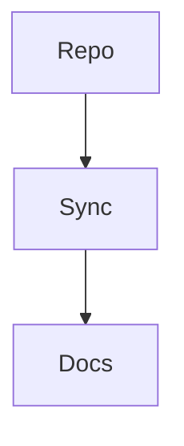

Inline **bold**, *italic*, `code`, and a [link](https://example.com).

```php
function dw_hello() {
	return 'from a fenced code block';
}
```

> [!TIP]
> This GFM alert should render as a Lemma callout.

| Column | Purpose |
| --- | --- |
| One | Tables convert too |
| Two | With a header row |

## Component tags

<Note>
Callouts written as component tags carry full markdown, fences included.

```bash
wp plugin list
```
</Note>

<CardGroup>
<Card title="Quick start" icon="rocket" href="https://deftwell.com">
Cards travel as component tags now.
</Card>
<Card title="Plain card">
No icon, no link, just prose.
</Card>
</CardGroup>

<Steps>
<Step title="Install the plugin">
Upload the zip and activate it.
</Step>
<Step title="Connect the repo">
Paste the token, then press Test connection.
</Step>
</Steps>

<Tabs>
<Tab title="npm">
Run the package manager you already use.
</Tab>
<Tab title="composer">
Or install through Composer instead.
</Tab>
</Tabs>

<CodeGroup>

```js app.js
console.log('hello');
```

```php title="functions.php"
add_action( 'init', 'lemma_boot' );
```

</CodeGroup>



## Passthrough

Blocks with no markdown form travel verbatim, like this contact form:

<!-- wp:fluentfom/guten-block {"formId":"6"} /-->

## Accordions

<Accordion title="How do refunds work?">
Open the order in FluentCart, choose **Refund**, and the license deactivates on its own.

<Note>
Partial refunds keep the license active.
</Note>
</Accordion>

<Accordion title="Can I move a license between sites?">
Deactivate it on the old site first; activation slots free up immediately.
</Accordion>
